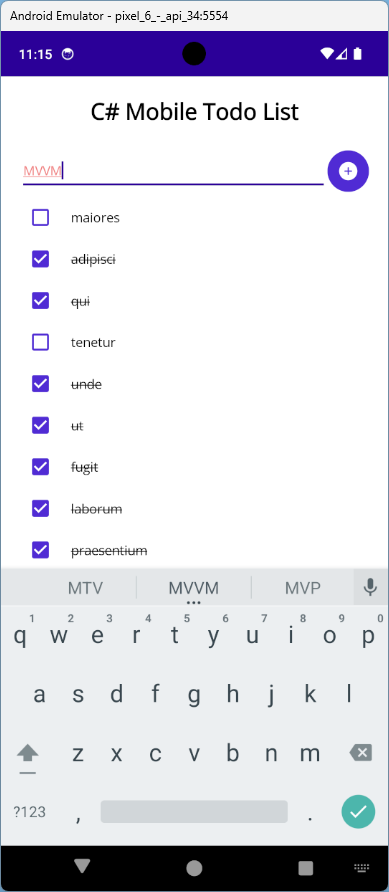
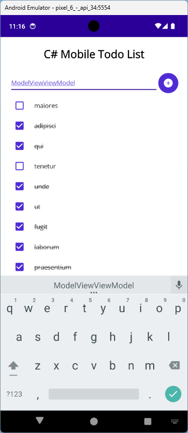
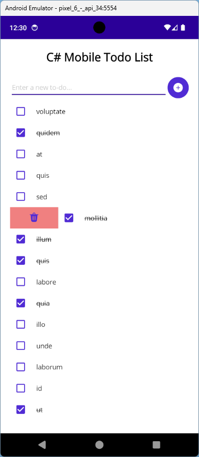

# Labo-MVVM
## Intro
In dit labo maken we een eenvoudige TODO applicatie, gebruik makend van het MVVM design pattern.

## Deel 1 
### View 
- Verwijder de bestaande *MainPage.xaml* en *MainPage.xaml.cs* bestanden
- Maak een nieuwe folder aan: *Pages*
- Maak een nieuwe *ContentPage* aan in deze folder: *TodoListPage*
- Zorg dat deze pagina getoond wordt als startpagina van de applicatie

### ViewModel
- Maak een nieuwe folder aan: *ViewModels*
- Maak een nieuwe *ViewModel* aan in de folder: *TodoListViewModel*
- Implementeer de *INotifyPropertyChanged* interface 
- Voeg een *AddTodoCommand* toe aan het ViewModel en zorg dat dit via binding gekoppeld wordt aan de *Button* bovenaan in de View. Zorg er ook voor dat de execute eigenschap van het *Command* verwijst naar de *AddTodo()* methode

### Model
- Maak een nieuwe folder aan: *Models*
- Maak een nieuwe *class* aan in deze folder: *TodoItem*:
```
public class TodoItem
{
    private string _title;
    private string _description;
    private bool _isCompleted;
    private DateTime _dueDate;

    public string Title { get => _title; set => _title = value; }
    public string Description { get => _description; set => _description = value; }
    public bool IsCompleted { get => _isCompleted; set => _isCompleted = value; }
    public DateTime DueDate { get => _dueDate; set => _dueDate = value; }
}
```
- Implementeer de *INotifyPropertyChanged* interface 
> ***Voorlopig gebruiken we enkel de Title en IsCompleted properties***

### MVVM
- Koppel nu het ViewModel aan de View:
```
public TodoListPage()
{
	InitializeComponent();
	this.BindingContext = new TodoListViewModel();
}
```

### Converter
- Maak een nieuwe folder aan: *Converters*
- Maak een nieuwe *class* aan in deze folder: *CompletedTextDecorationConverter*:
```
public class CompletedTextDecorationConverter : IValueConverter
{
    public object Convert(object value, Type targetType, object parameter, CultureInfo culture)
    {
        if (value is bool isCompleted && isCompleted)
            return TextDecorations.Strikethrough;
        return TextDecorations.None;
    }

    public object ConvertBack(object value, Type targetType, object parameter, CultureInfo culture)
    {
        throw new NotImplementedException();
    }
}
```
- Voeg de converter toe aan de *ResourceDictionary* in de *App.xaml*:
- Gebruik deze converter in de *TodoListPage.xaml* om te titel van een TodoItem door te strepen wanneer deze voltooid is:
```
TextDecorations="{Binding IsCompleted, Converter={StaticResource CompletedTextDecorationConverter}}"
```

### Behavior
- Gebruik de [TextValidationBehavior](https://learn.microsoft.com/nl-nl/dotnet/communitytoolkit/maui/behaviors/text-validation-behavior) om aan te duiden dat de titel van een nieuw item minstens 10 karakters bevat. 




## Deel 2 - Commands
- Maak een nieuw *Command* aan: *AddTodoCommand*
- Initialiseer dit *Command* in de constructor van het ViewModel en zorg dat het command de *AddTodo()* methode uitgevoert
- AddItem command toevoegen met canExecute wanneer newItemText is ingevuld
- Voeg een [EventToCommandBehavior](https://learn.microsoft.com/nl-nl/dotnet/communitytoolkit/maui/behaviors/event-to-command-behavior) toe aan de TodoListPage om het LoadDataCommand uit te voeren wanneer de pagina geladen wordt:
```
<ContentPage.Behaviors>
    <toolkit:EventToCommandBehavior 
        EventName="Appearing"
        Command="{Binding LoadDataCommand}"/>
</ContentPage.Behaviors>
```

## Deel 3 - MVVM CommunityToolkit
- Installeer de [MVVM toolkit](https://learn.microsoft.com/nl-nl/dotnet/communitytoolkit/mvvm/#getting-started)

### ViewModel
- Gebruik de MVVM Toolkit voor: 
  - de implementatie van INotifyPropertyChanged 
  > Tip: [ObservableObject](https://learn.microsoft.com/nl-nl/dotnet/communitytoolkit/mvvm/observableobject) 
  - het gebruik van Commands
  > Tip: [RelayCommand](https://learn.microsoft.com/nl-nl/dotnet/communitytoolkit/mvvm/relaycommand) 
> Bekijk ook zeker het [AsyncRelayCommand](https://learn.microsoft.com/nl-nl/dotnet/communitytoolkit/mvvm/asyncrelaycommand)!

### Model
- Gebruik de *ObservableObject* klasse in plaats van de *INotifyPropertyChanged** interface

## Deel 4
- Voeg een SwipeView toe aan de ItemTemplate van de CollectionView met onderstaande *LeftItems*:
```
<SwipeView.LeftItems>
    <SwipeItems>
        <SwipeItem mi:MauiIcon.Value="{mi:FluentFilled Icon=Delete32Filled, IconSize=Large, IconColor={StaticResource Primary}}"
                    BackgroundColor="LightCoral" />
    </SwipeItems>
</SwipeView.LeftItems>
```
- Voeg een *DeleteTodoCommand** toe aan het ViewModel en zorg dat dit via binding gekoppeld wordt aan de *SwipeItem* in de View. Zorg er ook voor dat de execute eigenschap van het *Command* verwijst naar de DeleteTodo methode
- Zorg dat het *TodoItem* object als *CommandParameter* wordt meegegeven aan de *DeleteTodo*-method

