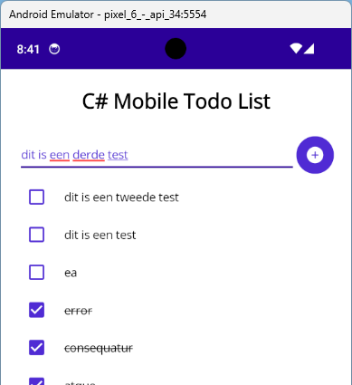
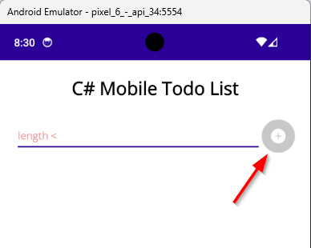
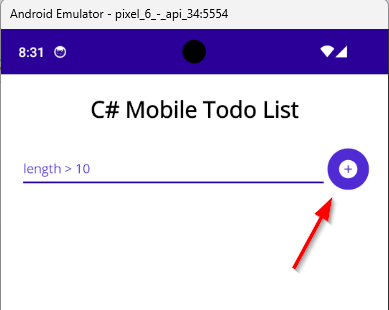
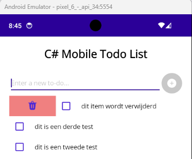
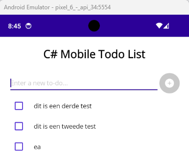

# Labo-MVVM
## Intro
In dit labo maken we een eenvoudige TODO applicatie, gebruik makend van het MVVM design pattern.

## Deel 1 
### View 
- Verwijder de bestaande *MainPage.xaml* en *MainPage.xaml.cs* bestanden
- Maak een nieuwe folder aan: *Pages*
- Maak een nieuwe *ContentPage* aan in deze folder: *TodoListPage*
- Zorg dat deze pagina getoond wordt als startpagina van de applicatie

```
<?xml version="1.0" encoding="utf-8" ?>
<ContentPage xmlns="http://schemas.microsoft.com/dotnet/2021/maui"
             xmlns:x="http://schemas.microsoft.com/winfx/2009/xaml"
             xmlns:mi="http://www.aathifmahir.com/dotnet/2022/maui/icons"
             x:Class="Todo.UI.Pages.TodoListPage"
             Title="TodoListPage"
             Shell.NavBarIsVisible="False">

    <!--<ContentPage.Resources>
        <Style x:Key="InvalidEntryStyle" TargetType="Entry">
            <Setter Property="TextColor" Value="LightCoral" />
        </Style>
        <Style x:Key="ValidEntryStyle" TargetType="Entry">
            <Setter Property="TextColor" Value="{StaticResource Primary}" />
        </Style>
    </ContentPage.Resources>-->

    <VerticalStackLayout Padding="20" Spacing="5">

        <!-- Title -->
        <Label Text="C# Mobile Todo List" 
               FontSize="Title"
               FontAttributes="Bold"
               HorizontalOptions="Center" 
               Margin="0,0,0,20" />

        <!-- Entry for New To-Do -->
        <Grid ColumnDefinitions="*,Auto">
            <Entry x:Name="NewToDoEntry"
                   Placeholder="Enter a new to-do..."
                   Text="">
            </Entry>
            <Button Grid.Column="1" CornerRadius="45" Padding="0"
                mi:MauiIcon.Value="{mi:FluentFilled Icon=AddCircle32Filled, IconSize=Large, IconColor={StaticResource White}}" />
        </Grid>

        <!-- List of To-Dos -->
        <CollectionView>
            <CollectionView.ItemTemplate>
                <DataTemplate >
                        
                    <Grid ColumnDefinitions="Auto,*">
                        <CheckBox IsChecked="True" />
                        <Label Grid.Column="1" 
                            Text="" 
                            VerticalOptions="Center"
                            Margin="10,0,0,0" />
                    </Grid>

                </DataTemplate>
            </CollectionView.ItemTemplate>
        </CollectionView>
    </VerticalStackLayout>
</ContentPage>
```

### ViewModel
- Maak een nieuwe folder aan: *ViewModels*
- Maak een nieuwe *ViewModel* aan in de folder: *TodoListViewModel*
- Implementeer de *INotifyPropertyChanged* interface 

```
public class TodoListViewModel 
{
    private string _newTodoTitle;
    private ObservableCollection<TodoItem> _todoItems;

    public string NewTodoTitle
    {
        get
        {
            return _newTodoTitle;
        }
        set
        {
            _newTodoTitle = value;
        }
    }

    public ObservableCollection<TodoItem> TodoItems 
    { 
        get => _todoItems; 
        set 
        {
            _todoItems = value;
        } 
    }

    public TodoListViewModel()
    {
		this.TodoItems = new ObservableCollection<TodoItem>();

        //TODO: Initialise commands:
    }

    private void AddTodo()
	{
		//TODO: add item to TodoItems, use NewTodoTitle as Title for the new item
		//TODO: clear the NewTodoTitle
    }

    private void DeleteTodo(TodoItem item)
    {
	    //TODO: remove item from TodoItems
    }
}
```

### Model
- Maak een nieuwe folder aan: *Models*
- Maak een nieuwe *class* aan in deze folder: *TodoItem*:
```
public class TodoItem
{
    private string _title;
    private string _description;
    private bool _isCompleted;
    private DateTime _dueDate;

    public string Title { get => _title; set => _title = value; }
    public string Description { get => _description; set => _description = value; }
    public bool IsCompleted { get => _isCompleted; set => _isCompleted = value; }
    public DateTime DueDate { get => _dueDate; set => _dueDate = value; }
}
```
- Implementeer de *INotifyPropertyChanged* interface 
> ***Voorlopig gebruiken we enkel de Title en IsCompleted properties***

### MVVM
- Koppel nu het ViewModel aan de View:
```
public TodoListPage()
{
	InitializeComponent();
	this.BindingContext = new TodoListViewModel();
}
```
- Configureer de *Compiled Bindings* voor zowel de *ContentPage* als de *CollectionView* in de *TodoListPage.xaml*:
- Koppel de *ItemsSource* van de *CollectionView* aan de *TodoItems* property van het ViewModel door middel van binding
- Voeg bindings toe voor de Views in de *ItemTemplate* van de *CollectionView* zodat de *Title* en *IsCompleted* properties van het *TodoItem* object correct weergegeven worden

### Converter
- Maak een nieuwe folder aan: *Converters*
- Maak een nieuwe *class* aan in deze folder: *CompletedTextDecorationConverter*:
```
public class CompletedTextDecorationConverter : IValueConverter
{
    public object Convert(object value, Type targetType, object parameter, CultureInfo culture)
    {
        if (value is bool isCompleted && isCompleted)
            return TextDecorations.Strikethrough;
        return TextDecorations.None;
    }

    public object ConvertBack(object value, Type targetType, object parameter, CultureInfo culture)
    {
        throw new NotImplementedException();
    }
}
```
- Voeg de converter toe aan de *ResourceDictionary* in de *App.xaml*:
- Gebruik deze converter in de *TodoListPage.xaml* om te titel van een TodoItem door te strepen wanneer deze voltooid is:
```
TextDecorations="{Binding IsCompleted, Converter={StaticResource CompletedTextDecorationConverter}}"
```

### Behavior
- Gebruik de [TextValidationBehavior](https://learn.microsoft.com/nl-nl/dotnet/communitytoolkit/maui/behaviors/text-validation-behavior) om aan te duiden dat de titel van een nieuw item minstens 10 karakters bevat. 


## Deel 2 - Commands
- Maak een nieuw *Command* property aan: *AddTodoCommand*
- Initialiseer dit *Command* in de constructor van het ViewModel en zorg dat het command de *AddTodo()* methode uitgevoert. Vervolledig ook deze methode.
- Zorg dat dit via binding gekoppeld wordt aan de *Button* bovenaan in de View.



- Voeg een [EventToCommandBehavior](https://learn.microsoft.com/nl-nl/dotnet/communitytoolkit/maui/behaviors/event-to-command-behavior) toe aan de TodoListPage om het LoadDataCommand uit te voeren wanneer de pagina geladen wordt:
```
<ContentPage.Behaviors>
    <toolkit:EventToCommandBehavior 
        EventName="Appearing"
        Command="{Binding LoadDataCommand}"/>
</ContentPage.Behaviors>
```
- Maak een *LoadDataCommand* aan in het ViewModel en zorg dat dit *Command* de methode de *LoadData()* methode uitvoert
- Gebruik de *LoadData* methode om de TodoItems collection te initialiseren met enkele dummy items uit de TodoDb klasse

## Deel 3 - MVVM CommunityToolkit
- Installeer de [MVVM toolkit](https://learn.microsoft.com/nl-nl/dotnet/communitytoolkit/mvvm/#getting-started)
> Voor versie 8.3.2 heb je de allerlaatste SDK van .NET 8 nodig. Gebruik een oudere versie indien nodig.

- Gebruik het [ObservableProperty](https://learn.microsoft.com/en-us/dotnet/communitytoolkit/mvvm/generators/observableproperty)-attribuut in plaats van de *INotifyPropertyChanged* interface voor zowel het Model als het ViewModel
- Vervang de bestaande *Commands* door gebruik te maken van het het [RelayCommand](https://learn.microsoft.com/en-us/dotnet/communitytoolkit/mvvm/generators/relaycommand)-attribuut
- Maak een CanAddTodo() functie aan die *true* retourneert wanneer NewTodoTitle.Length >= 10, zorg dat het *AddTodoCommand* enkel uitgevoerd kan worden wanneer *CanAddTodo()* "true" retourneert.  
  > Tip: [CanExecute](https://learn.microsoft.com/en-us/dotnet/communitytoolkit/mvvm/generators/relaycommand#enabling-and-disabling-commands)




> Voor uitzonderlijke gevallen waarbij de attributen onvoldoende functionaliteit bieden kan de *[ObservableObject](https://learn.microsoft.com/nl-nl/dotnet/communitytoolkit/mvvm/observableobject)* basisklasse en het [RelayCommand](https://learn.microsoft.com/en-us/dotnet/communitytoolkit/mvvm/relaycommand) en/of [AsyncRelayCommand](https://learn.microsoft.com/nl-nl/dotnet/communitytoolkit/mvvm/asyncrelaycommand) gebruikt worden.

## Deel 4 - Relative Binding
- Voeg een SwipeView toe aan de ItemTemplate van de CollectionView met onderstaande *LeftItems*:
```
<SwipeView.LeftItems>
    <SwipeItems>
        <SwipeItem mi:MauiIcon.Value="{mi:FluentFilled Icon=Delete32Filled, IconSize=Large, IconColor={StaticResource Primary}}"
                    BackgroundColor="LightCoral" />
    </SwipeItems>
</SwipeView.LeftItems>
```
- Voeg een *DeleteTodoCommand* toe aan het ViewModel en zorg dat dit via binding gekoppeld wordt aan de *SwipeItem* in de View. Zorg er ook voor dat de execute eigenschap van het *Command* verwijst naar de *DeleteTodo()* methode
- Zorg dat het *TodoItem* object als *CommandParameter* wordt meegegeven aan de *DeleteTodo*-method


